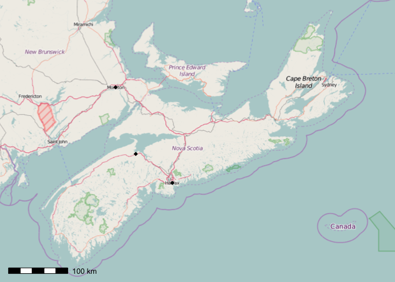

Prettymapr: Tools for rapid, publication-grade mapping in R
===========================================================

[](https://cran.r-project.org/package=prettymapr)

Prettymapr automates the process of creating a scale bar and north arrow in any package that uses base graphics to plot in R. Bounding box tools help find and manipulate extents. Geocoding tools help plot locations on maps. Finally, there is a function to automate the process of setting margins, plotting the map, scale bar, and north arrow, and resetting graphic parameters upon completion.

Installation
------------

The prettymapr package is available on CRAN, and can be installed using `install.packages("prettymapr")`. The manual is also [available on the CRAN website](https://cran.r-project.org/web/packages/prettymapr/prettymapr.pdf)

Bounding box tools
------------------

The concept of a bounding box is integral to the [rosm](https://cran.r-project.org/package=rosm) and [rcanvec](https://cran.r-project.org/package=rcanvec) packages (as well as some others), so there's a few tools to create/manipulate them here. I can never remember the proper way to create a bounding box using `sp::bbox()`, so the `makebbox(n, e, s, w)` function is included to make this process a little easier (I can somehow always remember 'never eat shredded wheat' for the cardinal directions). The easiest way to get these numbers is from the [Open Street Maps Export page](http://www.openstreetmap.org/export).

``` r
library(prettymapr)
makebbox(50.1232, -122.9574, 50.1035, -123.0042)
```

    ##         min       max
    ## x -123.0042 -122.9574
    ## y   50.1035   50.1232

It is, of course, easier to search for bounding boxes by human-readable location (google maps style), although this requires some confidence in the internet to recognize your location (the default `source` is the [Pickpoint API](https://pickpoint.io/), although you can pass `source="google"` to use the [Google Maps API](https://developers.google.com/maps/).

``` r
searchbbox("alta lake, british columbia")
```

    ##          min        max
    ## x -123.00891 -122.96891
    ## y   50.08865   50.12865

If you pass a vector into `searchbbox()` it will return the bounding box that contains all of them.

``` r
searchbbox(c("halifax, ns", "moncton, nb", "wolfville, ns"))
```

    ##         min       max
    ## x -64.91537 -63.41497
    ## y  44.48842  46.17745

And, if you don't care to modify the values yourself to zoom in or out, you can use `zoombbox()`.

``` r
bb <- makebbox(50.1232, -122.9574, 50.1035, -123.0042)
zoombbox(bb, 0.8) # zooms out a tad
```

    ##          min        max
    ## x -123.01005 -122.95155
    ## y   50.10104   50.12566

Geocoding tools
---------------

Sometimes it's nice to be able to put cities on maps without having to look up their latitude and longitude, which is where the `geocode()` function comes in handy. It should be noted that the [ggmap package](https://cran.r-project.org/package=ggmap) also has a `geocode()` function that is more suited to large numbers of requests. If you do a lot of this, please [get your own API key](https://pickpoint.io/users/sign_up) so not everybody is using up mine (get one for the Google Maps API [here](https://developers.google.com/maps/documentation/geocoding/get-api-key) ).

``` r
results <- geocode(c("halifax, NS", "wolfville, NS", "moncton, NB"))
names(results) # several standard columns
```

    ##  [1] "query"   "source"  "status"  "rank"    "address" "lon"     "lat"    
    ##  [8] "bbox_n"  "bbox_e"  "bbox_s"  "bbox_w"  "id"

``` r
results[c("query", "address", "lon", "lat")]
```

    ##           query                                            address
    ## 1   halifax, NS       Halifax, Halifax County, Nova Scotia, Canada
    ## 2 wolfville, NS       Wolfville, Kings County, Nova Scotia, Canada
    ## 3   moncton, NB Moncton, Westmorland County, New Brunswick, Canada
    ##         lon      lat
    ## 1 -63.57497 44.64842
    ## 2 -64.36449 45.09123
    ## 3 -64.79897 46.09733

Mapping tools
-------------

There's also a few mapping tools in prettymapr, most notably the `prettymap()` function, which evaluates its first argument while setting the margins to 0 (which is probably what you want for plotting a map). It also automatically adds a scalebar (although you could do this yourslef using the `addscalebar()` function).

``` r
library(rosm)
prettymap(osm.plot(searchbbox("nova scotia")))
```



Any plotting code has to go within `prettymap()`, so if you need multiple lines you can enclose them in curly brackets (`{}`). There's tons of options for `prettymap()` that let you customize the north arrow, scale bar etc., which you can find in the [{prettymapr} manual](https://cran.r-project.org/web/packages/prettymapr/prettymapr.pdf).

``` r
cities <- geocode(c("halifax, NS", "wolfville, NS", "moncton, NB"))
prettymap({
  osm.plot(searchbbox("nova scotia"))
  osm.points(cities$lon, cities$lat, pch=18)
})
```


Any plotting code that uses base plotting can be used inside `prettymap()`, including [rosm](https://cran.r-project.org/package=rosm), [rcanvec](https://cran.r-project.org/package=rcanvec), [OpenStreetMap](https://cran.r-project.org/package=OpenStreetMap), [cartography](https://cran.r-project.org/package=cartography), [marmap](https://cran.r-project.org/package=marmap), and others. If only a scale bar or north arrow are required, there are independent functions to add to existing code.

``` r
library(maptools)
data("wrld_simpl")
plot(wrld_simpl, xlim=c(-131, -52), ylim=c(10, 55))
addscalebar()
addnortharrow()
```


That's it for now! More convenience functions on the way...
